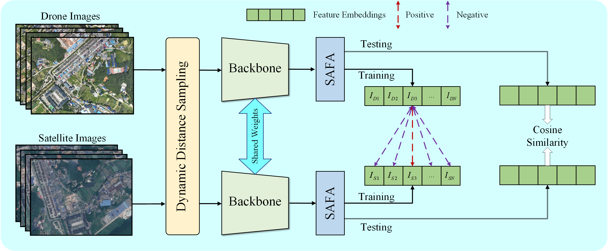

# ComplexUAV: A Visual Localization Benchmark for UAVs in Complex Multi-Terrain Environments



*ComplexUAV Architecture*


## Dataset and download:
The training datasets are [SUES-200](https://github.com/Reza-Zhu/SUES-200-Benchmark), [University-1652](https://github.com/layumi/University1652-Baseline), [DenseUAV](https://github.com/Dmmm1997/DenseUAV//blob/main/docs/Request.md), ComplexUAV

If you want to access ComplexUAV, please contact chenjunlong22@sina.com. Note that this dataset is for academic research purposes only.

Our dataset will be gradually expanded.

## Prerequisites
- Python 3.8
- GPU Memory >= 6G
- Pytorch 1.13.0+cu116
- Torchvision 0.14.0+cu116

##  Tools
### Get flops
```bash
python tools/get_model_flops_params.py
```

### Get infertime
```bash
python tools/get_model_inference_time.py
```

### Heatmaps
```bash
python tools/grad_cam_resnet50.py
```

### visual
```bash
python tools/visualization.py
```

### Compute MGMD
```bash
# Contrastive Framework
python tools/compute_MDGM.py 

# Classification Framework
python tools/compute_MDGM_cls.py 
```


##  Quickly Start
###  train
```bash
# Contrastive Framework
python train_ddp.py 

# Classification Framework
python train_cls_ddp.py
```

### evaluate
```bash
# Contrastive Framework
python evaluate_all.py 

# Classification Framework
python evaluate_all_cls.py 
```

## TO-DO List

- [ ] Improve README.md (ing...)
